# AgriWeatherPro Project Structure

```mermaid
graph TD
    Root[AgriWeatherPro] --> Public[public/]
    Root --> Src[src/]
    Root --> Supabase[supabase/]
    Root --> Config[Configuration Files]
    Root --> Docs[docs/]
    Root --> Database[database/]
    Root --> Design[design-elements/]
    
    Public --> PublicHTML[HTML Files]
    Public --> PublicImages[images/]
    Public --> PublicCSS[CSS Files]
    
    Src --> Components[components/]
    Src --> Pages[pages/]
    Src --> API[api/]
    Src --> Lib[lib/]
    Src --> Contexts[contexts/]
    Src --> Utils[utils/]
    Src --> Services[services/]
    Src --> Styles[styles/]
    Src --> Assets[assets/]
    Src --> AppFiles[App Files]
    
    Components --> UIComponents[UI Components]
    Components --> FeatureComponents[Feature Components]
    Components --> LayoutComponents[Layout Components]
    
    UIComponents --> LoadingScreen[LoadingScreen/]
    UIComponents --> LocationAutocomplete[LocationAutocomplete/]
    
    FeatureComponents --> WeatherForecast[WeatherForecast.js]
    FeatureComponents --> WeatherMap[WeatherMap.js]
    FeatureComponents --> CropYieldDisplay[CropYieldDisplay.js]
    
    LayoutComponents --> Sidebar[Sidebar/]
    LayoutComponents --> Header[Header.js]
    LayoutComponents --> Footer[Footer.js]
    LayoutComponents --> ServicesMenu[ServicesMenu/]
    
    Pages --> MainPages[Main Pages]
    Pages --> AuthPages[Auth/]
    Pages --> ServicePages[ServicePages/]
    
    MainPages --> HomePage[Home.js]
    MainPages --> DashboardPage[Dashboard.js]
    MainPages --> AboutPage[About.js]
    MainPages --> ForecastPage[Forecast.js]
    MainPages --> MapsPage[Maps.js]
    MainPages --> CropYieldsPage[CropYields.js]
    
    AuthPages --> SignIn[SignIn.js]
    AuthPages --> SignUp[SignUp.js]
    AuthPages --> ForgotPassword[ForgotPassword.js]
    AuthPages --> ResetPassword[ResetPassword.js]
    AuthPages --> AuthError[AuthError.js]
    
    ServicePages --> IrrigationPlanning[IrrigationPlanning.js]
    ServicePages --> PestManagement[PestManagement.js]
    
    API --> WeatherAPI[weatherApi.js]
    API --> AuthAPI[auth.js]
    API --> MockData[mockData.js]
    
    Lib --> SupabaseClient[supabase.js]
    Lib --> SupabaseFixed[supabase-fixed.js]
    Lib --> DatabaseUtils[database.js]
    
    Contexts --> AuthContext[AuthContext.js]
    
    Utils --> ConfigUtils[config.js]
    Utils --> WeatherUtils[weatherUtils.js]
    Utils --> SimulationUtils[simulationUtils.js]
    Utils --> TradeAPIUtils[tradeApiUtils.js]
    
    Services --> SupabaseService[supabaseService.js]
    Services --> WeatherService[weatherService.js]
    
    Styles --> AppCSS[App.css]
    Styles --> DashboardCSS[Dashboard.css]
    Styles --> FixesCSS[fixes.css]
    
    AppFiles --> AppJS[App.js]
    AppFiles --> IndexJSX[index.jsx]
    AppFiles --> AppCSS2[app.css]
    AppFiles --> IndexCSS[index.css]
    AppFiles --> SetupProxy[setupProxy.js]
    AppFiles --> ReportWebVitals[reportWebVitals.js]
    
    Supabase --> Functions[functions/]
    Supabase --> Migrations[migrations/]
    
    Functions --> CreateProfile[create-profile/]
    Functions --> HelloWorld[hello-world/]
    Functions --> Shared[_shared/]
    
    Config --> EnvFiles[.env Files]
    Config --> PackageJSON[package.json]
    Config --> TailwindConfig[tailwind.config.js]
    Config --> ViteConfig[vite.config.js]
    Config --> NetlifyConfig[netlify.toml]
```

## Key Components

### Core Features
- **Weather Forecast**: Real-time weather data visualization
- **Crop Yield Analysis**: Agricultural yield predictions based on weather data
- **Interactive Maps**: Geospatial visualization of weather and agricultural data
- **User Authentication**: Secure login and profile management

### Technical Stack
- **Frontend**: React.js with modern functional components
- **Styling**: CSS Modules with Tailwind CSS
- **Backend**: Supabase for authentication and database
- **APIs**: OpenWeatherMap integration for weather data
- **Deployment**: Netlify for hosting

## Cleaned-up Structure
The project structure has been cleaned up by:
1. Removing redundant files (reportWebVitals.backup.js, Dashboard.js.bak, etc.)
2. Consolidating duplicate functionality (Dashboard component moved to pages)
3. Standardizing naming conventions
4. Organizing related files into appropriate directories
5. Ensuring proper imports and exports between modules 